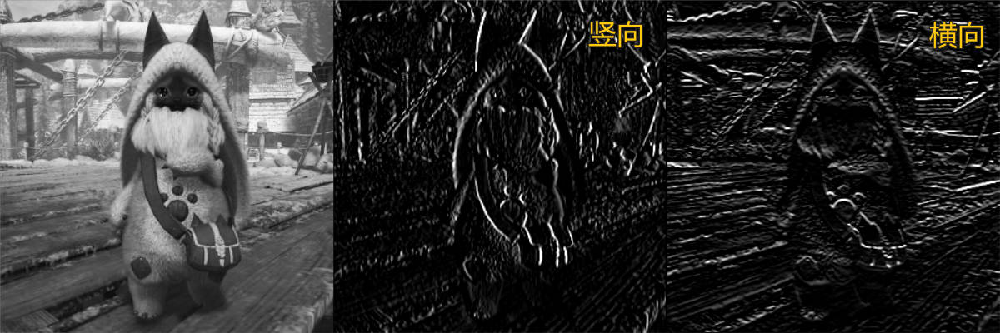
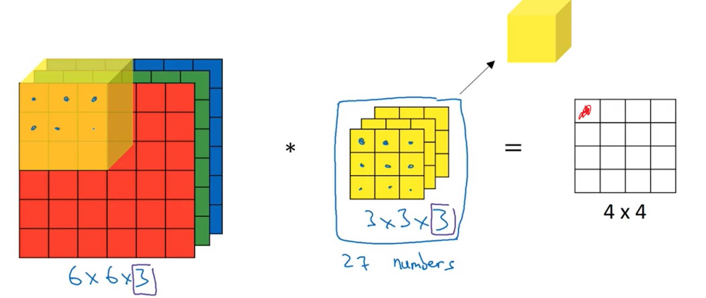
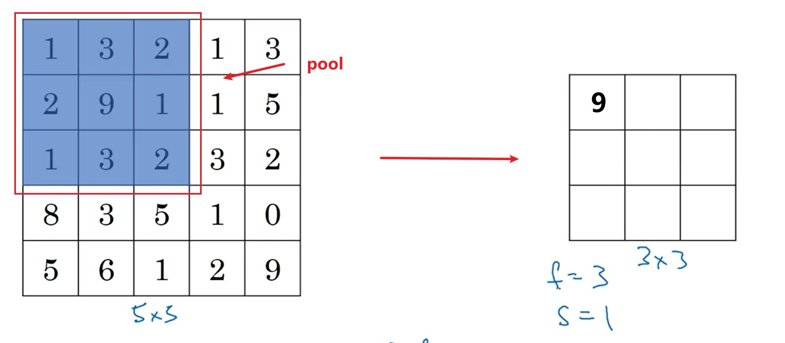

# 卷积神经网络

# 一、卷积

## 1.1 数学运算

<!-- panels:start -->
<!-- div:left-panel -->

- **单步卷积**：计算流程如上图所示，卷积核（过滤器）与图片颜色通道值对应相乘，然后乘积结果再相加。
- **卷积移动**：如动态图所示，输入为 `7x7` ，卷积核`3x3`，卷积核移动步长`1`，输出结果为`5x5`
<!-- div:right-panel -->

<!-- panels:end -->

- **输出维度**：
    $$
    n_o = \lfloor \frac{n_{i} + 2p - f}{s} + 1\rfloor 
    $$
  - f : 过滤器的纬度 
  - p : 输入图片填充的像素
  - s : 过滤器在输入图像上移动的步长

**当步长s不为1时，可能导致过滤器越界，所以使用floor进行向下取整。**

> [!tip]
> 在图像识别中所说的“卷积”和实际定义有一点小差别，图像识别省略了：对过滤器进行右对角线的翻转（对结果没啥影响，没必要算了）。图像识别中的卷积准确应当称之为：`cross-correlation`。

## 1.2 Padding

卷积计算后，原来的图像会被缩小，为了规避这个问题，可以将原来的图像的进行边缘扩充像素。卷积核的步长一般取`s=1`，那么上面的式就变为

$$
n_o = n_i + 2p - f + 1
$$

现在要使得 $n_o = n_i$，可以求解得

$$
p = \frac{f-1}{2}
$$

因此，只要再对原图扩充`p`个像素，就能使得卷积后的图像尺寸和输入图像一样大。例如对`5x5`的输入，卷积核取`3x3`，步长为`1`，当取`p=1`时，输出结果与原图尺寸一样。

> [!note|style:flat]
> 从上面公式可以看出，当卷积步长为`1`且卷积核的尺寸`f` 为奇数时，计算得到的`p`值为整数。因此，一般会选用「奇数」尺寸的卷积核。例如`3x3`、`5x5`、`7x7`等。

# 二、卷积操作

## 2.1 边缘监测

&emsp;&emsp;定义一个竖向的过滤器，就能实现对竖向的边缘进行监测；同样定义一个横向的过滤器，就能对一个横向的边缘进行监测。对于过滤器的值，可以自定义，不用完全是-1或者1。

## 2.2 其他卷积操作

<a href="https://blog.csdn.net/kingroc/article/details/88192878" class="jump_link"> 卷积操作 </a>

# 三、卷积神经网络

## 3.1 卷积层
### 1 卷积核

> [!note|style:flat]
> 从上一节可以知道，对图片进行「卷积操作」后，可以对「图像特征」进行提取。因此，卷积神经网络就直接将卷积核中的所有系数都设置为`w`系数，然后通过训练得到具体的卷积核。

### 2 三维卷积

- 输入的通道数和过滤器的通道数相同，才能进行计算。
- 所有颜色通道进行一步卷积计算后，得到一个输出结果，**即颜色通道被降维**。

### 3 卷积层结构

图中展示的卷积层：一张图像通过两个滤波器，计算得到两层结果；再将两层送入激活函数；最后将两个层重合得到输出。**这里的卷积核可以设置多个。**

$$
    a^{[l]} = active(input * filter + bias)  \tag{5.1}
$$

## 3.2 池化层（pooling）

 不同于卷积，池化的作用是将原来的像素，按照块操作，进行压缩处理。 根据压缩数据方式的不同分为：
- `max pooling`，区域内的最大值；
- `average pooling`，区域求平均值。

$$
n_o = \lfloor \frac{n_{i} - f}{s} + 1\rfloor \tag{6.1}
$$

> [!note]
> * 对于pooling的计算，每一个颜色通道分别进行一次计算，输出结果通道数不改变。
> * pooling涉及的超参数，训练集训练时视为常量。

## 3.3 卷积神经网络模型

* **图像刚输入的时候，靠卷积和池化提取特征，降低图片参数数量。**
* **输出就是靠全连接网络（BP网络）和分类器获取估计结果。**

## 3.4 卷积的作用

&emsp;&emsp; 与普通神经网络相比，卷积网络大大降低了超参数的量，实现了对图像像素的压缩和特征提取。

> * **parameter sharing**：用于一次过滤的过滤器都是一样的，数据处理过程统一，也降低了超参数的量。
> * **sparsity of connection**：每个像素只能影响局部的结果，符合常规认知。
