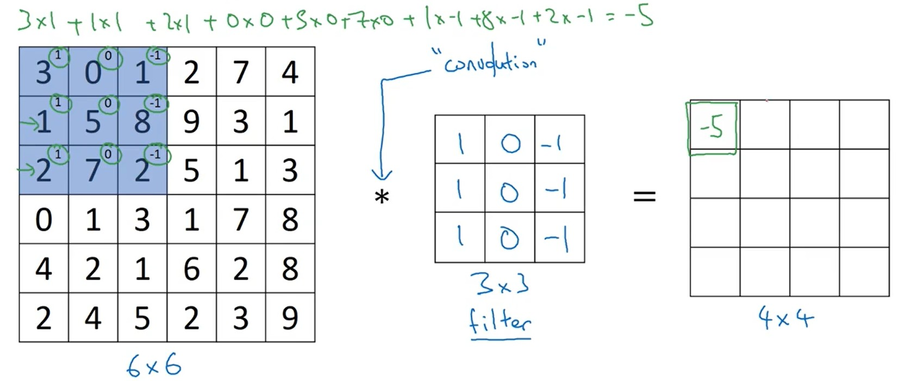
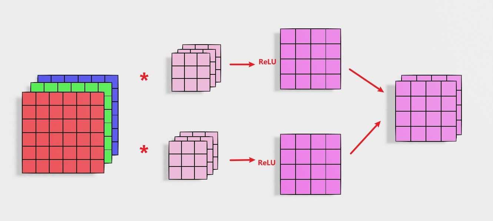

# 卷积神经网络

# 一、卷积

## 1.1 数学运算

<!-- panels:start -->
<!-- div:left-panel -->

- **单步卷积**：计算流程如上图所示，卷积核（过滤器）与图片颜色通道值对应相乘，然后乘积结果再相加。
  $$
  \begin{aligned}
  e&=H * A \\
  &=\left[\begin{array}{lll}
  \mathrm{h}_{11} & \mathrm{~h}_{12} & \mathrm{~h}_{13} \\
  \mathrm{~h}_{21} & \mathrm{~h}_{22} & \mathrm{~h}_{23} \\
  \mathrm{~h}_{31} & \mathrm{~h}_{32} & \mathrm{~h}_{33}
  \end{array}\right] *\left[\begin{array}{ccc}
  a & b & c \\
  d & e & f \\
  g & h & i
  \end{array}\right] \\
  &=\operatorname{sum}\left(\left[\begin{array}{lll}
  \mathrm{a} \times \mathrm{h}_{11} & \mathrm{~b} \times \mathrm{h}_{12} & \mathrm{c} \times \mathrm{h}_{13} \\
  \mathrm{~d} \times \mathrm{h}_{21} & \mathrm{e} \times \mathrm{h}_{22} & \mathrm{f} \times \mathrm{h}_{23} \\
  \mathrm{~g} \times \mathrm{h}_{31} & \mathrm{~h} \times \mathrm{h}_{32} & \mathrm{i} \times \mathrm{h}_{33}
  \end{array}\right]\right)
  \end{aligned}
  $$
- **卷积移动**：如动态图所示，输入为 `7x7` ，卷积核`3x3`，卷积核移动步长`1`，输出结果为`5x5`
<!-- div:right-panel -->

<!-- panels:end -->

- **输出维度**：
    $$
    n_o = \lfloor \frac{n_{i} + 2p - f}{s} + 1\rfloor 
    $$
  - f : 过滤器的纬度 
  - p : 输入图片填充的像素
  - s : 过滤器在输入图像上移动的步长

**当步长s不为1时，可能导致过滤器越界，所以使用floor进行向下取整。**

> [!tip]
> 在图像识别中所说的“卷积”和实际定义有一点小差别，图像识别省略了：对过滤器进行右对角线的翻转（对结果没啥影响，没必要算了）。图像识别中的卷积准确应当称之为：`cross-correlation`。

## 1.2 Padding

卷积计算后，原来的图像会被缩小，为了规避这个问题，可以将原来的图像的进行边缘扩充像素。卷积核的步长一般取`s=1`，那么上面的式就变为

$$
n_o = n_i + 2p - f + 1
$$

现在要使得 $n_o = n_i$，可以求解得

$$
p = \frac{f-1}{2}
$$

因此，只要再对原图扩充`p`个像素，就能使得卷积后的图像尺寸和输入图像一样大。例如对`5x5`的输入，卷积核取`3x3`，步长为`1`，当取`p=1`时，输出结果与原图尺寸一样。

> [!note|style:flat]
> 从上面公式可以看出，当卷积步长为`1`且卷积核的尺寸`f` 为奇数时，计算得到的`p`值为整数。因此，一般会选用「奇数」尺寸的卷积核。例如`3x3`、`5x5`、`7x7`等。

# 二、卷积操作

## 2.1 边缘监测

&emsp;&emsp;定义一个竖向的过滤器，就能实现对竖向的边缘进行监测；同样定义一个横向的过滤器，就能对一个横向的边缘进行监测。对于过滤器的值，可以自定义，不用完全是-1或者1。

## 2.2 其他卷积操作

<a href="https://blog.csdn.net/kingroc/article/details/88192878" class="jump_link"> 卷积操作 </a>

# 三、卷积神经网络

## 3.1 卷积层
### 1 卷积核

> [!note|style:flat]
> 从上一节可以知道，对图片进行「卷积操作」后，可以对「图像特征」进行提取。因此，卷积神经网络就直接将卷积核中的所有系数都设置为`w`系数，然后通过训练得到具体的卷积核。

### 2 三维卷积

- 输入的通道数和过滤器的通道数相同，才能进行计算。
- 所有颜色通道进行一步卷积计算后，得到一个输出结果，**即颜色通道被降维**。

### 3 卷积层结构

图中展示的卷积层：一张图像通过两个滤波器，计算得到两层结果；再将两层送入激活函数；最后将两个层重合得到输出。**这里的卷积核可以设置多个。**

$$
    a^{[l]} = active(input * filter + bias)  \tag{5.1}
$$

## 3.2 池化层（pooling）

 不同于卷积，池化的作用是将原来的像素，按照块操作，进行压缩处理。 根据压缩数据方式的不同分为：
- `max pooling`，区域内的最大值；
- `average pooling`，区域求平均值。

$$
n_o = \lfloor \frac{n_{i} - f}{s} + 1\rfloor \tag{6.1}
$$

> [!note]
> * 对于pooling的计算，每一个通道分别进行一次计算，输出结果通道数不改变。
> * pooling涉及的超参数，训练集训练时视为常量。

## 3.3 卷积神经网络模型

* **图像刚输入的时候，靠卷积和池化提取特征，降低图片参数数量。**
* **输出就是靠全连接网络（BP网络）和分类器获取估计结果。**

## 3.4 卷积的作用

&emsp;&emsp; 与普通神经网络相比，卷积网络大大降低了超参数的量，实现了对图像像素的压缩和特征提取。

> * **parameter sharing**：用于一次过滤的过滤器都是一样的，数据处理过程统一，也降低了超参数的量。
> * **sparsity of connection**：每个像素只能影响局部的结果，符合常规认知。

# 1x1 卷积

- **压缩信道并改变信道维度：** 对于单信道的输入数据来说，`1x1`的卷积没啥鸟用，结果就是在原理的输入上通乘一个数，并没有对特征进行提取。但是对于多信道的输入数据，`1x1` 卷积实现了对输入特征图在信道方向上的压缩，例如 `6x6x32` 的输入，经过`1` 个 `1x1` 卷积核的卷积结果为 `6x6x1`，经过`2`个 `1x1`卷积核的卷积结果为 `6x6x2`

- **缩减计算次数与参数：** 

  没有引入`1x1` 卷积步骤，其乘法计算次数为：`(28x28x32)x(5x5x192)=120,422,400`；卷积核系数个数为：`5x5x192x32=153600`

  

  引入`1x1`卷积步骤后，其乘法计算次数为：`(28x28x16)x192 + (28x28x32)x(5x5x16) = 12,433,648`；卷积核系数个数为：`192*16+5x5x16x32=15872`

  

  在中间步骤中，引入`1x1`卷积，乘法计算量缩小为原来的 `10.3 %`，参数个数缩减为原来的`10.3 %`

# 五、卷积网络模型

## 5.1 经典卷积网络

### 5.1.1 LeNet-5

- **作用：** 识别手写数字
- **特点：** 提出了每个「卷积层」之后添加一个「池化层」

### 5.1.2 AlexNet

- **作用：** 给包含有1000种类别的共120万张高分辨率图片进行分类
- **特点：** 在隐含层中设置了大量的参数，并且卷积层的通道数也比较大
- **意义：** 从这个网络模型开始，计算机视觉的研究开始重视深度学习的应用。

### 5.1.3 VGG16

- **作用：** 图像分类
- **特点：** 
  1. 利用最简单的卷积和池化进行网络搭建，卷积核的尺寸越小，对于图片特征就更加的敏感。
  2. 更加丧心病狂的添加隐含层信道

## 5.2 残差网络

- **作用：** 随着传统深度学习网络 `Plain network` 加深时，其模型预测结果并非越来越好，反而会变得更差。为了实现深层网络的学习，何凯明等人提出了「残差网络」，在 `dlib` 库中，人脸特征描述符的预测，就利用了该网络。

- **残差块：** 在计算 $a^{[ l+2 ]}$ 时，添加了 $a^{[l]}$ 的结果
  $$
  a^{[l+2]} = g(W^{[l+2]}a^{[l+1]} + b^{[l+2]} + M a^{[l]})
  $$

  其中 $M$ 为维度转换矩阵，当 $a^{[l]}$ 与 $a^{l+2}$ 的维度不一样时，需要对 $a^{[l]}$ 的维度进行转化，需要当作网络参数进行学习；当 $a^{[l]}$ 与 $a^{l+2}$ 的维度一样时 $M$ 就是一个单位阵，不要学习。

- **残差块工作原理：** 假设网络模型的训练结果为 $W^{[l+2]}=0,b^{[l+2]} = 0$，则
  $$
  a^{[l+2]} = g(0+M a^{[l]})
  $$

  从结论上来看看，$a^{[l+2]}$ 的计算结果只与 $a^{[l]}$ 相关， 即 $[l+1]$ 层网络被屏蔽了，网络隐含层被减少。又由于  $W^{[l+2]}=0,b^{[l+2]} = 0$ 只是极端情况，实际中出现概率低， $[l+1]$ 层肯定会起点作用的，因此最终的隐含层多的网络模型肯定比隐含层少的效果要好。 

- **卷积网络：** 在卷积网络中的使用方法同理。

  

## 5.3 inception 网络

- **作用：** 当我们不知道当前卷积层采用哪个类型卷积核更好，还是说当前层不卷积而是进行池化的时候，这是就可以利用 inception 网络，让模型自己判断。

- **inception层：** 将不同卷积核以及池化后的结果在信道方向上堆叠起来，组合成当前隐含层，这个组合层就是「inception层」。从上图中可以看出，这样设计模型后，参数量核计算量都挺大，因此应用 `1x1` 卷积核，实现计算量与参数压缩

  

  **其中为了保持池化后特征图的「尺寸」不变，这里在池化之前，首先对原图进行了 padding**

- **inception 网络：** 使劲堆叠 inception 层

  

## 5.4 GoogleNet

在 inception 网络的基础上， 为了避免梯度消失，增加了两个「辅助分类（上图红框）」用于向前传导梯度。

## 5.5 迁移学习

> [!tip]
> 从头训练自己的模型，费时又费力，可以通过迁移学习抄别人的网络，实现偷懒。

- **方法一：** 将红色框框住的部分「系数冻结」，重新训练自己任务的「输出层」
  

- **方法二：** 对别人模型的「前面几层」进行系数冻结，后面部分自己重新训练或者设计
  

- **方法三：** 用给人的「前面几层」是作为一个「特征转换函数」，用该特征函数对自己的样本进行预处理，之后再根据预处理结果进行模型设计
  

- **方法四：** 将别人的的模型权重系数初始化自己模型，之后重新训练

> **为什么要选择别人模型的「前面几层」？**

越靠前卷积层，着重的是对「局部特征」的提取；越靠后的层级则是注重对检测目标的「整体特征」进行过滤，例如对于第一层卷积得到的特征图的一个像素位置对应「原图」的`3x3`，第二层卷积得到的特征图的一个像素位置对应「原图」的 `5x5`，**即越靠后的卷积层，看见原图区域越广，「感受野」越大。**
- **感受野**：特征图上的一个像素位置对应原始图多大区域。

## 5.6 全连接层卷积化

在传统网络中，经过卷积层特征提取后的数据最后都会接入全连接层进行最终结果的输出，**然而接入全连接层后，就会导致输入的图片尺寸必须固定**。

由于多通道的`1x1`卷积运算和全连接层的远算其实是类似，就可以通过 `1x1` 的卷积操作将原来的全连接层转化为卷积层。

# 六、目标检测

## 6.1 概念区分

计算机视觉需要解决的问题有：分类、检测、分割。

- **classification：** 单目标分类，区分图片里的类容是人、动物、植物或者汽车等，例如 softmax 层、二分类问题。
- **classification localization：** 目标定位，单目标分类并标记出目标位置，即画出目标的 bounding box 
  

- **object detection：** 目标检测，从图片中查找出所有的目标物体，并绘制所有目标的 bounding box
  

- **semantic segmentation：** 语义分割，将目标物体从背景图片分离出来，但是目标物体之间不做区分
  

- **instance segmentation：** 实列分割，将目标物体从背景图片分离出来，并且还要区分各个目标物体
  

## 6.2 目标定位

在之前网络中，输入图片，然后图片经过卷积、池化、全连接后，最后接入 softmax 层就实现了图像分类。为了实现目标定位，只需在原来分类的基础上，添加矩形框

$$
\hat{y} = [p_c,b_x,b_y,b_h,b_w,c_1,c_2,c_3,\dotsm]^T
$$

其中 $p_c$，图片中是否存在目标物体；$b_x,b_y$，矩形框的中心点；$b_h,b_w$，矩形框的长、宽；$c_1,c_2,c_3,\dotsm$，检测目标的分类

## 6.3 特征点检测

**landmark detection**：特征点检测，标记出要检测目标中的关键点，例如人脸关键点、手势识别、骨骼关键点。网络输出添加特征点坐标 $(x_i,y_i)$，并且关键点的输出顺序固定。

## 6.4 目标检测

### 6.4.1 滑动窗口

**步骤：**

1. 利用滑动窗口在输入图像中扫描，对原图进行裁剪
2. 利用训练好的「图片分类器」对裁剪的图片进行类型判别，判别结果若是检测目标，滑动窗口的当前位置就是目标位置。

在`dlib`库中的人脸检测就采用了该思路，首先对目标图片提取 HOG 特征，然后利用 SVM 支持向量机对特征进行判别。

### 6.4.2 卷积滑动

- **原因：** 利用传统的滑动窗口对目标进行检测，一个区域一个区域的遍历，然后对每个区域又进行一次检测，这个是是否消耗计算机性能，为了加快计算速度可以将「滑动窗口」改为「卷积」。

- **原理：** 首先将原来的图片分类模型的全连接层[卷积化](#56-全连接层卷积化)

  

  这里假设分类模型的输入图片大小为`3x3`，首先进行`3x3`卷积，然后模仿全连接层进行两次 `1x1` 卷积，其中对于模型中的信道数都忽略了。
  
  按照原来的分类模型思路，就是每次检测只输入一张 `3x3` 的图片，然后经过模型处理后，得到该图片的分类结果。**但是，对全连接层进行卷积化后，对于图片的输入大小将不再限制。因此，可以直接将整张图片输入分类模型中**

  

  假设原始图片的大小为 `4x4` 对该图片直接进行分类模型运算，输出结果就为 `2x2`，对于该输出结果的每个格子就对应了原图中的 `4` 个`3x3`的滑动窗口，**即卷积的结果就是滑动窗口的计算结果**。
  
- **优点：**  将滑动窗口卷积化，会大大加快滑动窗口计算速度。  上述案例，对模型进行简化，看来计算速度是一样的，其对于复杂模型而言，卷积代替滑动，就省略了大量的重复操作。
  

  以上图模型的第一层卷积层为例，滑动窗口大小为 `14x14`，步长为 `2`，滑动`4`次。
  - 传统滑动窗口进行检测，第一层卷积乘法运算次数：`4x(10x10x16)x(5x5x3) = 480,000`
  - 卷积检测，第一层运乘法运算次数：`(12*12*16)*(5*5*3)=172,800`
  
### 6.4.2 R-CNN 算法

传统的滑动窗口只是利用滑动窗口漫无目的的一块区域一块区域的扫描图片，然而通常一张图片中，背景区域是要多余目标的区域，滑动窗口法就检测了许多无意义的背景区域，加大了运算量。**R-CNN 算法的思想就是，提前从图片中筛选一些有意义的候选区域，然后再对这些区域进行目标分类。** 

可以通过图像分割，提前筛选区域。如下图，利用图片分割将输入图片拆分成了不同区域，然后利用 OpenCV 中的「轮廓检测」，就能将每个区域的 bounding box 提取出来，并对这些外接矩形进行筛选，最后剩下的 bounding box 就是我们进行检测的候选框。

### 6.4.3 YOLO 算法

<a href="https://spite-triangle.github.io/artificial_intelligence/#/./yolo/README" class="jump_link"> YOLO 算法 </a>